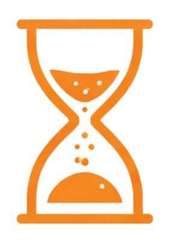

# UNTIL

<p align="center">
  
</p>

**Skill-based quiz. Pay per question. Stop when it's optimal.**

---

## Links

| | |
|:--|:--|
| **Whitepaper** | [until.gg/whitepaper](./client/public/whitepaper.md) |
| **Live Demo** | [until.gg](https://until-stx.vercel.app) |

## Tech stack

<p>
  
  
  
  
  
  
  
  
</p>

| Layer | Stack |
|:--|:--|
| **Frontend** | Next.js 16, React 19, TypeScript, Tailwind, Stacks Connect |
| **Backend** | Node.js, Express, TypeScript |
| **Data** | MongoDB (Mongoose), Redis |
| **Chain** | Stacks (STX), x402 |

---

## Repo structure

- **`client/`** — Next.js app (App Router)
- **`server/`** — Express API (credits, questions, runs, users)
- **`docs/`** — Whitepaper (source), roadmap, audit

---

## Quick start

```bash
# Client
cd client && npm install && npm run dev

# Server (separate terminal; needs Mongo, Redis, .env)
cd server && npm install && npm run dev
```

See `client/.env.example` and `server/.env.example` for required env vars.
