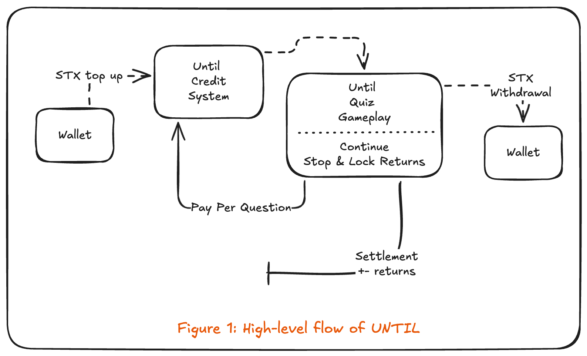

|  | **UNTIL** |
|:--|:--|

## **Skill-based quiz. Pay per question. Stop when it’s optimal.**

*Whitepaper v1.0*

**Date:** February 2026  
**Status:** Hackathon MVP (Stacks Testnet)

**Author:** Shobhit Tiwari  
**Affiliation:** Independent / Hackathon submission  
**Contact:** [shobhit141142@gmail.com](mailto:shobhit141142@gmail.com)

---

## Abstract

UNTIL is a skill-based quiz platform where every question is a paid economic decision on the Stacks blockchain. Players top up once in STX, play from an in app credit balance, and earn or lose based on correctness, speed, and critically **when they choose to stop**. The system uses **HTTP 402 Payment Required** (x402) and on-chain verification for top-ups and withdrawals; scoring and payouts are deterministic and server authoritative. UNTIL does not issue its own token, does not charge a platform fee, and is designed around **optimal stopping theory**: players win by stopping at the right moment, not by luck. This document describes the current architecture, tokenomics, credits flow, question system, and a roadmap including scaling (K tiers), subscription tiers, social/challenge modes, AI evolution, quality improvements, streak incentives, governance, programmatic x402, and mainnet deployment.

---

## 1. Introduction

### 1.1 Problem & Vision

Most quiz and trivia apps monetize via ads or flat subscriptions; gameplay and economics are disconnected. UNTIL ties **each question to a real economic cost and reward**: you pay to play the next question, earn more for answering correctly and quickly, and keep your winnings only if you **stop at the right time**. The result is a clear, skill based loop: **pay → play → decide (continue or stop) → settle**.

The vision is to be the reference **pay-per-decision** experience on Stacks: transparent tokenomics, wallet as identity, and a credits model that minimizes wallet popups while keeping blockchain as the source of truth for money in and out.

### 1.2 Core Principles

- **Wallet = identity.** No email, OAuth, or passwords. Stacks wallet (e.g. Leather) is the only auth.
- **Payment gates every question.** No free plays in paid mode; AI and question delivery happen only after payment (or credit balance) is verified.
- **Blockchain = source of truth.** Top up and withdrawal are verified on-chain; MongoDB stores users and history but is not the authority for funds.
- **Skill-based, not gambling.** Outcomes are deterministic (correct/incorrect, time multiplier); no hidden odds, no house edge, no randomness in payouts.
- **Optimal stopping.** Profit is achieved by stopping at the right moment; continuing past that point is a deliberate risk.

---

## 2. Technical Overview

### 2.1 Stack

- **Network & currency:** Stacks; currency STX. Current deployment: **testnet**; mainnet is a stated future milestone.
- **Backend:** Node.js, Express, TypeScript. MongoDB (Mongoose) for users, runs, credit transactions, and question audit; Redis for challenge and deduplication state.
- **Payments:** HTTP 402 with x402-style flow; Stacks RPC/API for transaction fetch and verification. Top-up: verify STX transfer to platform address (confirmed + anchored); idempotent by `txId`. Withdrawal: debit credits, broadcast STX to user via `@stacks/transactions`.
- **Frontend:** Next.js (App Router), Tailwind, Stacks Connect / wallet integration; brutalist, readable UI.

UNTIL **does not issue a proprietary token**. All value is in STX.

### 2.2 Payment & Credits Flow

- **Top-up:** User sends STX to platform recipient (suggested 0.05 STX). Backend verifies tx (exists, success, anchored, recipient match, amount &gt; 0), then credits the sender’s in-app balance. Same `txId` applied twice returns success without re-crediting and without leaking balance (idempotent).
- **Play:** User spends from **credits**. Before each question the server checks balance ≥ required cost (for current run or for full run at start). No per-question wallet signature; one top-up funds many decisions.
- **Settlement:** On **stop** (after ≥ 4 levels) or **wrong answer / timeout**, a single settlement runs: `profit = earned − totalSpent`; profit/loss is applied to credits; milestone bonus (if any) is added. No immediate on-chain payout at stop; user’s balance is updated in DB.
- **Withdrawal:** User requests withdrawal (min 0.01 STX). Backend debits credits, broadcasts STX to user’s wallet; on broadcast failure, credits are refunded.

Pre start check: starting a run requires balance ≥ total cost for levels 0–9. Mid-run insufficient balance triggers 402 with options to top up or pull out (settle/stop); run history is always persisted.

**Figure 1: High-level flow of UNTIL**

### 2.3 Security & Verification

- Correct answers are **never** sent to the client; scoring is server-only. Run state (correct index, timing) lives in memory with TTL and is cleared when the run ends.
- Answer submission requires `walletAddress`; server verifies that the run belongs to that wallet (403 otherwise).
- Stacks addresses are validated (SP/ST + 39 chars) on all wallet-accepting endpoints. Top-up and withdrawal amounts are validated; withdrawal is capped by balance.

---

## 3. Tokenomics

### 3.1 Currency & Scaling

- **Currency:** STX. **Network:** Stacks (testnet today; mainnet in roadmap).
- **Scaling factor K:** All monetary amounts (cost, base reward, milestone pool) scale with **K**. Formula: `actual = base × (K/100)`. K does **not** change game logic, EV, or fairness—only the magnitude of stakes.

| K (current / planned) | Role |
|-----------------------|------|
| **100** | **Default (MVP).** Design scale; accessible stakes. |
| 250 | **Future: Pro.** Higher stakes for engaged players (configurable). |
| 500 | **Future: Elite.** Highest stakes tier (configurable). |
| 10–25 | Toy/demo. |
| 500–2000 | Real USD-like stakes (opt-in). Cap 2000. |

**Current production:** K = 100. Future tiers may expose K = 250 (Pro) and K = 500 (Elite) as part of subscription or skill-based tiers.

### 3.2 Difficulty & Cost

- **Levels:** 1–10 (0-indexed 0–9 in code). Difficulty increases automatically each question; user does not select difficulty, only **continue** or **stop**.
- **Minimum before stop:** User must complete **at least 4 levels** before the “Stop & lock result” action is allowed (early stop via “pull out” when insufficient credits remains available for settlement).
- **Cost and base reward (at K=100):** 1:1 per level; best-case reward ≈ 1.5× cost (speed multiplier). Base table (STX, K=100):

| Level | Cost (STX) | Base Reward (STX) | Best-case profit (1.5×) |
|-------|------------|-------------------|-------------------------|
| 1 | 0.72 | 0.72 | 0.36 |
| 2 | 1.44 | 1.44 | 0.72 |
| 3 | 2.16 | 2.16 | 1.08 |
| 4 | 2.88 | 2.88 | 1.44 |
| 5 | 4.32 | 4.32 | 2.16 |
| 6 | 6.48 | 6.48 | 3.24 |
| 7 | 9.36 | 9.36 | 4.68 |
| 8 | 12.96 | 12.96 | 6.48 |
| 9 | 17.28 | 17.28 | 8.64 |
| 10 | 22.32 | 22.32 | 11.16 |

Early levels are low-cost; later levels are riskier. Infinite play is economically irrational.

### 3.3 Earning & Time

- **Time limit:** Every question has a **30-second** cap. Answer after time counts as **wrong** (run ends; earned so far kept; current level cost lost).
- **Time multiplier (deterministic buckets):** `ratio = solveTime / 30`.

| Ratio | Multiplier |
|-------|------------|
| ≤ 60% | 1.5× |
| 60–90% | 1.2× |
| 90–100% | 1.0× |
| &gt; 100% (timeout) | Wrong; run ends |

**Earned per correct answer:** `earnedStx = baseRewardStx(level) × timeMultiplier`. Total earned = sum over correct answers in the run. No points→STX conversion; amounts are STX directly.

### 3.4 Settlement & Milestones

- **Profit:** `profit = totalEarned − totalSpent`. No platform fee; net = gross.
- **Milestone bonus (fixed, no RNG):** Pool = 4.5 STX at K=100, scaled by K. Run cap = 10 questions.
  - **70% completion** (≥ 7 correct): bonus = pool/4.
  - **100% completion** (10 correct): bonus = full pool.
- Bonus is applied at run end (stop or wrong); server-only.

---

## 4. Credits System (Primary UX)

- **Start:** 0 credits (or existing balance from prior top-up or profit).
- **Top-up:** One wallet tx to platform address; suggested 0.05 STX; backend verifies and credits (idempotent by `txId`).
- **Play:** Costs deducted from credits; no wallet pop per question. Balance must cover required cost before each question (or full run at start).
- **Stop / wrong:** Single settlement (profit/loss + optional milestone) applied to credits.
- **Withdraw:** Anytime balance ≥ 0.01 STX; backend debits and sends STX to user wallet.

Constants: `MIN_WITHDRAW_STX = 0.01`, `TOP_UP_SUGGESTED_STX = 0.05`.

---

## 5. Question System

### 5.1 Categories (Current)

Curated, skill-based categories; same category for the whole run; difficulty via reasoning depth, not obscurity. Examples: Situational Reasoning, Attention Traps, Mental Shortcuts, Constraint Puzzles, Elimination Logic, Estimation Battles, Ratios in Disguise, Everyday Science, One-Move Puzzles, Patterns and Sequences. Rules: single correct answer, verifiable, no opinions, answerable in ≤ 30 seconds; no pure memorization or trick phrasing.

### 5.2 Hybrid Model (MVP)

UNTIL supports **AI-generated** questions but, due to resource limits and the need for consistent quality, uses a **hybrid model**: static question sets per category/level, with optional AI generation and batching. AI is invoked only after payment/credit check; it **never** affects scoring or payouts. Question quality and category coverage are explicit areas for future improvement (see Roadmap).

### 5.3 Quality & Fairness

- Server side sanity checks (confidence, duplicate hash, time bounds, difficulty progression); max regenerations then fallback/refund.
- Correct answer and scoring are server-only; client never receives `correct_index` in production.

---

## 6. Why This Is Not **Gambling**

| Gambling | UNTIL |
|----------|--------|
| Random outcomes | Deterministic (correct/incorrect, time buckets) |
| Hidden odds | Transparent cost/reward and time multiplier |
| Luck-based | Skill + decision (when to stop) |
| House edge | No platform fee |
| Forced continuation | Player chooses when to stop |

**One-liner:** UNTIL is a skill-based optimal-stopping system where each paid question is an economic decision; profit comes from stopping at the right moment.

---

## 7. Current State (MVP)

- **Mode:** Solo play only. One player, one run; no sharing or head-to-head yet.
- **Monetization:** No paid subscription; anyone with credits can play. No Pro/Elite paywall.
- **K:** Fixed at 100 (configurable via env for operators).
- **Network:** Stacks testnet.
- **Auth:** Wallet only; no message signing for withdraw/profile (documented limitation).

---

## 8. Roadmap & Future Work

### 8.1 Scaling Tiers (K)

- **Current:** K = 100 (default).
- **Future:** Configurable K per tier: **Pro** (e.g. K = 250), **Elite** (e.g. K = 500) for higher stakes, with clear UX and risk disclosure.

### 8.2 Subscription & Monetization

- **Current:** No paid plan; credits are the only payment.
- **Future:**  
  - **Pro plan:** One-time or recurring; may be required for the primary credit-based play (e.g. “Pro” unlocks full credit system and higher K).  
  - **Elite plan:** Premium tier with additional benefits (e.g. higher milestone weight, exclusive categories, or priority support), to be defined with user base and economics.

### 8.3 Social & Competitive Modes

- **Current:** Solo matches only.
- **Future:**  
  - **Run sharing:** Players can share a completed run (e.g. link or embed) so others can view the same sequence (and optionally try the same category/level flow).  
  - **Challenge others:** “Challenge with my run”—others attempt the same or a mirrored run; results comparable.  
  - **1v1 quiz:** Head-to-head matches after a substantial user base; format and scoring TBD (e.g. same questions, first-correct or score differential).

### 8.4 AI & Question Pipeline

- **Current:** Hybrid (static + optional AI); AI used with guardrails and fallbacks.
- **Future:**  
  - **Matchmaking / discovery:** AI to recommend categories, difficulty, or runs.  
  - **Question generation:** Deeper use of AI for unique, high-quality questions within strict rules (single answer, ≤ 30s, no trick).  
  - **Multi-level AI architecture:** Layered pipeline (generation, filtering, difficulty tagging, deduplication) to support a consistent, unique, and engaging experience as scale and resources allow.

### 8.5 Question & Category Quality

- Continuous improvement of question clarity, difficulty calibration, and category design. Investment in content and review processes; possible community or expert input over time.

### 8.6 Streak & Engagement Incentives

- **Current:** Milestone bonus only (70% and 100% completion).
- **Future:** **Streak-based incentives** (e.g. consecutive correct answers or consecutive profitable runs) alongside the existing milestone pool, with clear rules and caps to keep economics stable.

### 8.7 Governance & Safety

- **Future:** Grievance reporting, dispute resolution, and conflict settling (e.g. reporting abuse, contested runs, or support escalations). Policies and tooling to be defined with scale.

### 8.8 Programmatic x402 Integrations

- UNTIL as a **reference implementation** for x402 on Stacks. Future work may include:  
  - **Public APIs** for paid questions (other apps pay per question via 402).  
  - **Embeddable “pay-per-decision” widgets** for third-party sites.  
  - **Templates and docs** for developers building x402-powered applications.

### 8.9 Mainnet & Scaling

- After sufficient testing and audits on **Stacks testnet**, UNTIL may transition to **Stacks mainnet**, with appropriate risk disclosure, K and stake limits, and operational safeguards. Scaling of infrastructure, monitoring, and support will follow mainnet launch.

---

## 9. Risks & Disclaimers

- **Testnet:** Current deployment uses testnet STX; value is not mainnet value.  
- **Smart contracts:** Withdrawals are executed by the platform (server-signed txs); no user-facing smart contract risk in the current design.  
- **Custody:** Credits are book entries; platform holds STX for withdrawals. Users should only keep amounts they accept as platform risk.  
- **Regulation:** Applicable law may treat quiz-for-value differently by jurisdiction; no legal advice is intended.  
- **No guarantee:** Past performance, EV formulas, or bonus structures do not guarantee future results; parameters (K, costs, milestones) may change with notice.

---

## 10. References

- Stacks: [https://docs.stacks.co/](https://docs.stacks.co/)  
- HTTP 402 Payment Required / x402: payment-gated APIs; UNTIL uses 402 for “pay then get question” and for top-up prompts.  
- Optimal stopping: decision-theoretic basis for “when to stop” in sequential decisions with known cost/reward structure.

---

## Document Info

- **Version:** 1.0  
- **Date:** February 2026  
- **Status:** Hackathon MVP (Stacks Testnet). Living document; roadmap and future work are indicative and may change.  
- **Author:** Shobhit Tiwari  
- **Affiliation:** Independent / Hackathon submission  
- **Contact:** [shobhit141142@gmail.com](mailto:shobhit141142@gmail.com)
- **Audience:** Developers, operators, and stakeholders evaluating UNTIL’s design and evolution.
